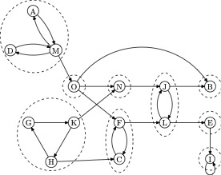
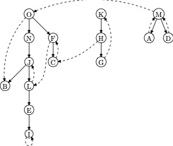

# network

Data structures and network algorithms

## Tree 

This program has both the depth-first search and the breath-first search of trees.

## Strongly Connected Components

In directed graph, we find strongly connected components using the algorithm
proposed by R. E. Tarjan.  The example was introduced by D. E. Knuth during
his Christmas lecture in 2024.

Example problem:

Depth-first forest of the digraph above:

